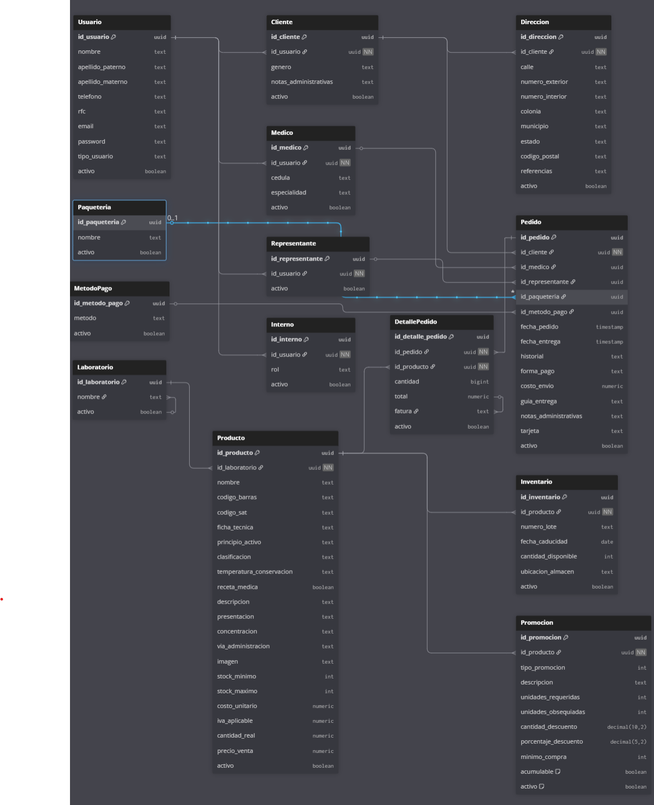

# Progalenica - Backend (Server)

Este proyecto corresponde al backend de la aplicación **Progalenica**, una API RESTful desarrollada en Node.js con Express y Sequelize para la gestión de productos farmacéuticos, pedidos, clientes, médicos, representantes y paqueterías.

## Imagen de la database 

    

## Tecnologías principales

- **Node.js** y **Express** para el servidor y la gestión de rutas.
- **Sequelize** como ORM para la conexión y manipulación de la base de datos PostgreSQL.
- **dotenv** para la gestión de variables de entorno.
- **Morgan** y **body-parser** para logging y parseo de peticiones.
- **Jest**, **Mocha** y **Chai** para pruebas.

## Estructura de carpetas

```
Server/
│
├── index.js                # Punto de entrada del servidor
├── package.json            # Dependencias y scripts
├── .env                    # Variables de entorno (no versionado)
├── src/
│   ├── app.js              # Configuración principal de Express
│   ├── config/
│   │   ├── database.js     # Configuración y modelos de Sequelize
│   │   └── env.js          # Variables de entorno
│   ├── models/             # Definición de modelos Sequelize
│   ├── routes/             # Definición de rutas principales
│   ├── productos/          # Controladores y rutas de productos
│   ├── paqueterias/        # Controladores y rutas de paqueterías
│   ├── clientes/           # (Futuro) Controladores y rutas de clientes
│   ├── medicos/            # (Futuro) Controladores y rutas de médicos
│   ├── representantes/     # (Futuro) Controladores y rutas de representantes
│   ├── administradores/    # (Futuro) Controladores y rutas de administradores
│   ├── pedidos/            # (Futuro) Controladores y rutas de pedidos
│   └── utils/              # Utilidades generales
└── ...
```

## Modelos principales

- **Producto**: nombre, código de barras, precio unitario, cantidad real.
- **Paqueteria**: nombre.
- **Cliente**: datos personales y dirección.
- **Representante**: nombre, teléfono, correo.
- **Médico**: nombre, teléfono, cédula, especialidad.
- **Pedido**: estado, fechas, historial, forma de pago, costo de envío, etc.
- **DetallesPedido**: cantidad, total, factura.
- **Administrador**: nombre, correo, teléfono, rol, activo.

Las relaciones entre modelos están definidas en [`src/config/database.js`](src/config/database.js).

## Endpoints principales

- `/progalenica/productos`: CRUD de productos.
- `/progalenica/paqueterias`: CRUD de paqueterías.
- (Próximamente) Endpoints para clientes, médicos, representantes, pedidos y administradores.

## Configuración y uso

1. **Clona el repositorio** y entra en la carpeta `Server`.
2. Crea un archivo `.env` con tus credenciales de base de datos PostgreSQL.
3. Instala las dependencias:
   ```sh
   npm install
   ```
4. Inicia el servidor:
   ```sh
   npm run dev
   ```
   El servidor escuchará en el puerto definido en `.env`.

## Scripts útiles

- `npm run dev`: Inicia el servidor en modo desarrollo con nodemon.
- `npm start`: Inicia el servidor en modo producción.
- `npm test`: Ejecuta los tests.

## Notas

- El archivo `.env` y `node_modules/` están excluidos del control de versiones.
- El backend está preparado para ser consumido por un frontend (no incluido en esta carpeta).

---
